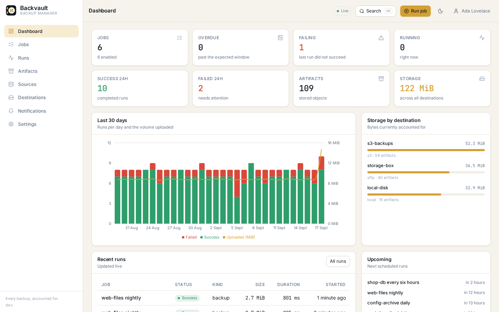
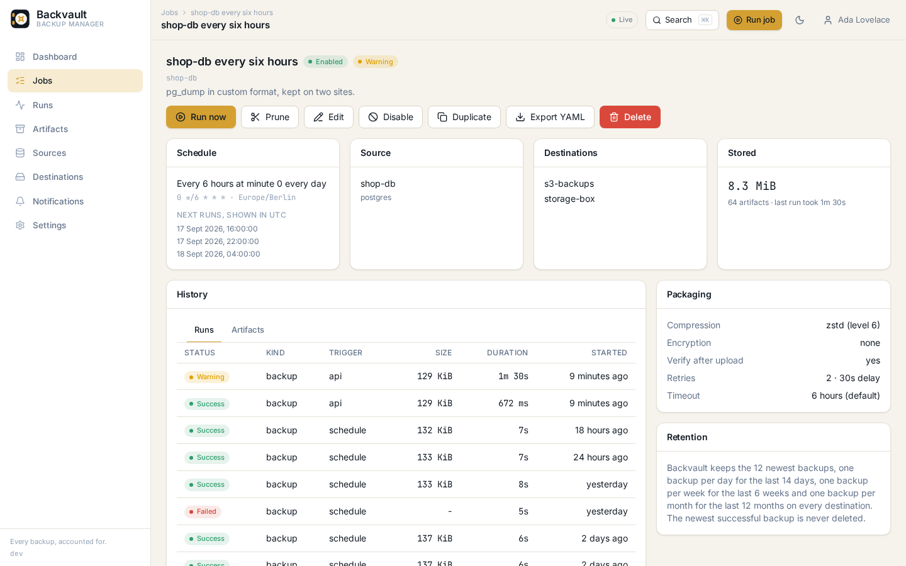
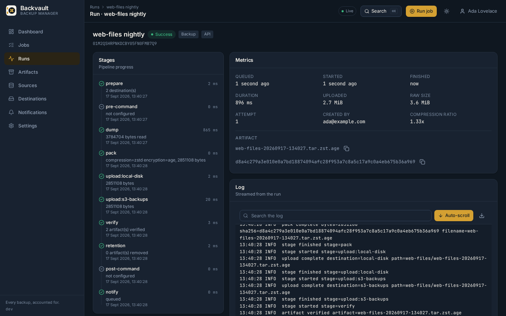
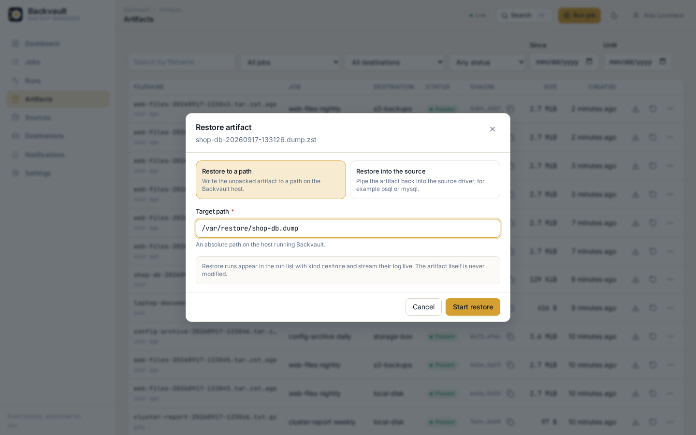
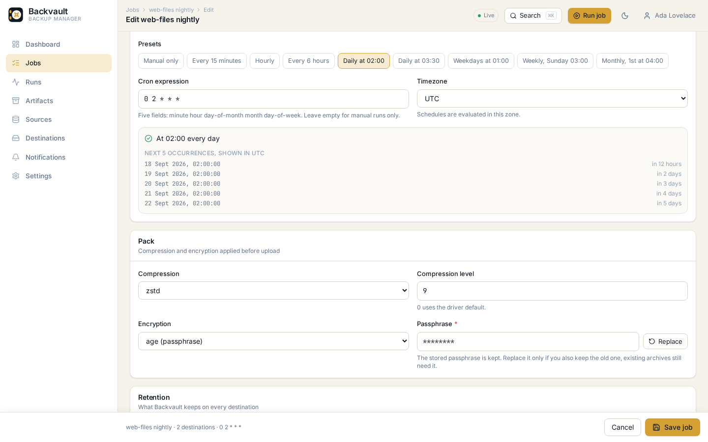
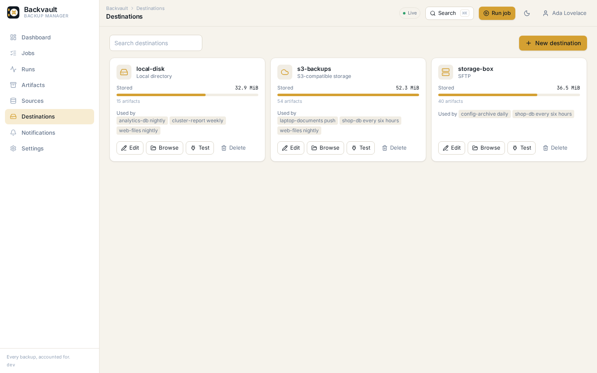
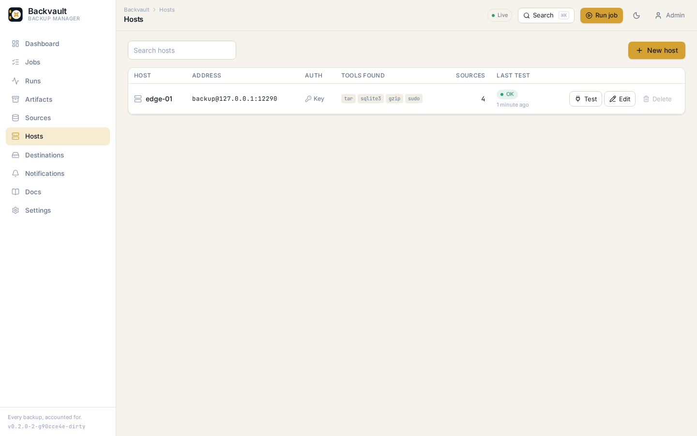
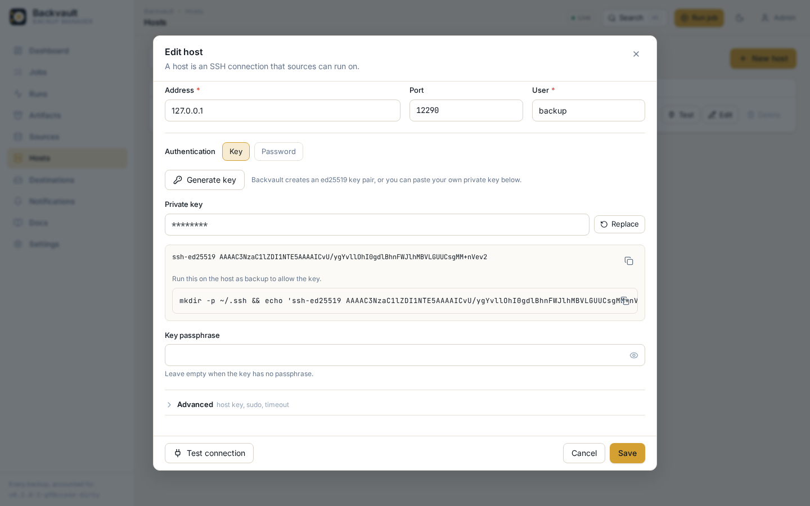

**Every backup, accounted for.**

[](https://github.com/arthurr0/backvault/actions/workflows/ci.yml)
[](https://github.com/arthurr0/backvault/releases)
[](LICENSE)
[](go.mod)

Backvault is a self-hosted backup manager: one Go binary, one admin panel, and a clear answer
to the only question that matters at 03:00, which backups exist and can I restore them. It
dumps databases, servers and plain files, ships the artifacts to S3 compatible storage, SFTP
hosts such as a Hetzner Storage Box, WebDAV or a local disk, applies retention, verifies what
it stored, restores on request and tells you when a backup did not happen.

No agent to install on every host, no external database, no message queue. SQLite holds the
state, the React panel is embedded in the binary, and hosts that cannot run Backvault can push
into it with a single bash script.

## Screenshots

| | |
|---|---|
|  |  |
| Dashboard with run history and storage per destination | A job, its runs and its artifacts |
|  |  |
| Live run log streamed over SSE | Restore to a path or back into the source |
|  |  |
| The job editor with the schedule builder and packing | Destinations with usage per store |
|  |  |
| SSH hosts with the tools found on each one | A generated key and its authorized_keys snippet |

## What it does

- **Sources**: PostgreSQL, MySQL and MariaDB, MongoDB, Redis, SQLite, files and directories,
  a command over SSH, a Docker volume or a command inside a running container, any local
  command, and push jobs that receive artifacts from remote scripts.
- **Hosts**: a reusable SSH connection with a key Backvault generates for you, host key
  pinning and optional sudo. Point a source at a host and its `tar`, `pg_dump` or `sqlite3`
  runs on that machine instead of the Backvault server, with only the finished stream
  travelling back. Nothing is installed on the host.
- **Destinations**: S3 compatible storage (AWS, MinIO, Backblaze B2, Wasabi, Cloudflare R2,
  Hetzner Object Storage), SFTP, WebDAV and local directories. A job can write to several at
  once.
- **Scheduling**: cron expressions with a timezone, a next run preview, and a watcher that
  flags a job as overdue when a run did not happen.
- **Packing**: zstd or gzip compression and age encryption with a passphrase, applied on the
  way to the destination so the artifact is already protected in transit and at rest. The
  sha256 is taken from the same stream that is uploaded.
- **Retention**: keep last, hourly, daily, weekly, monthly, yearly and a maximum age, applied
  per destination, with the newest successful artifact always protected.
- **Verify and restore**: a verify pass that confirms every artifact is still present at its
  destination with the size Backvault recorded, download with automatic decryption, restore to
  a path on the host, or restore straight back into the source database.
- **Notifications**: email, webhook with an HMAC signature, Slack, Discord, Telegram and
  ntfy, filtered per job and per event.
- **Operations**: live run logs over SSE, Prometheus metrics, an audit log, API tokens with
  scopes, and YAML export and import of the whole configuration.
- **Built-in documentation**: the full documentation ships inside the binary and is served by the
  panel at `/docs`, with search, syntax highlighted commands and an on-page table of contents, so it
  always matches the version you are running.
- **Batteries included image**: the container ships a PostgreSQL 18 client, so it dumps
  servers from 9.2 through 18, along with the MariaDB client, the MongoDB Database Tools,
  `redis-cli`, `sqlite3`, `age` and the Docker CLI.

## How it compares

Backvault is not another deduplicating archiver. It is the layer above one: the scheduler, the
dashboard, the restore button and the notification that something failed. It shells out to the
tools operators already trust (pg_dump, mysqldump, mongodump, tar, ssh, docker) and stores plain,
inspectable artifacts you can open without Backvault.

| | Backvault | restic / borg | Duplicati / Kopia | pgBackRest / mysqldump in cron |
|---|---|---|---|---|
| Databases as first class sources | yes, with native restore | no, files only | no, files only | one database engine each |
| Remote hosts over SSH and Docker volumes | yes | agent on each host | agent on each host | no |
| Admin panel with runs, artifacts, live logs | yes | no | yes | no |
| Push endpoint for hosts you cannot reach | yes, with overdue alerts | no | no | no |
| Artifact format | plain dump or tar, optional zstd and age | proprietary repository | proprietary repository | plain |
| Deduplication | no | yes | yes | no |
| Install | one binary or one container | one binary | service plus UI | packages and scripts |

If you need content-addressed deduplication of terabytes of files, pair Backvault with restic
through a command source. If you need to know every night that all your databases, servers and
buckets were backed up and can be restored, Backvault is the tool.

## Status

Backvault is at 0.1.0, the first public release. The code is complete against the
specification in [SPEC.md](SPEC.md) and the documentation describes what is actually
implemented, but the project is young and has not been through a long production life yet.

Verified against real services running in containers:

- PostgreSQL 18, MariaDB, MongoDB and Redis as sources, dumped and restored.
- MinIO for S3 compatible object storage, including multipart uploads.
- `atmoz/sftp` for the SFTP destination.
- Local directory destinations, the files, command, ssh and docker sources, packing,
  retention, verify and both restore modes.

Not yet exercised against the live service, only against the protocol or a compatible
implementation:

- AWS S3, Backblaze B2, Cloudflare R2, Wasabi and Hetzner Object Storage. They speak the same
  API as MinIO and the provider notes in the documentation are written from their
  documentation, not from a paid account.
- Hetzner Storage Box over SFTP and WebDAV, and Nextcloud over WebDAV.
- Live SMTP, Slack, Discord, Telegram and ntfy delivery. The payloads and signatures are
  tested, the deliveries are not.

If you run Backvault against one of those, an issue saying what worked or did not is the most
useful thing you can send.

## Quick start

Docker, one command:

```bash
docker run -d --name backvault \
  -p 8080:8080 \
  -v backvault-data:/data \
  -e BACKVAULT_BASE_URL=http://localhost:8080 \
  ghcr.io/arthurr0/backvault:latest
```

Docker Compose, including an optional MinIO and PostgreSQL to try things out:

```bash
docker compose -f deploy/docker-compose.yml up -d
docker compose -f deploy/docker-compose.yml --profile demo up -d
```

Binary, on a host with systemd. The installer downloads the release for your
architecture, verifies it against `checksums.txt`, and sets up the service:

```bash
curl -fsSL https://raw.githubusercontent.com/arthurr0/backvault/master/deploy/install.sh -o install.sh
sudo bash install.sh --download
```

Archives for linux and macOS on amd64 and arm64 are attached to every release at
<https://github.com/arthurr0/backvault/releases>, so you can also unpack one yourself. To build
from a checkout instead, which needs Go and Node:

```bash
git clone https://github.com/arthurr0/backvault.git
cd backvault
sudo ./deploy/install.sh
```

Then open <http://localhost:8080>, create the first admin account and you are on the
dashboard. The installer is idempotent, running it again upgrades the binary and leaves the
configuration, the data directory and the master key alone.

## Your first backup in 60 seconds

1. **Destinations, New**: kind `local`, path `/data/backups`, Test connection, Save.
2. **Sources, New**: kind `files`, paths `/etc`, Test connection, Save.
3. **Jobs, New**: pick the source and the destination, schedule `0 2 * * *`, compression
   `zstd`, retention keep last 7, Save.
4. Press **Run now** and watch the log stream. When it finishes you have an artifact with a
   size and a sha256.
5. Open the artifact and press **Download**, or **Restore** it to a path to prove it comes
   back.

Every write from the panel is a session request, so if you drive the same API by hand with a
cookie, send `X-Requested-With: backvault` as well. An API token does not need it.

The longer version, including a PostgreSQL database going to S3 with encryption, is in
[docs/first-backup.md](docs/first-backup.md).

## Pushing from a host that does not run Backvault

Create a push job and an API token with the `ingest` scope, then from the other host:

```bash
pg_dump -Fc shop | zstd | scripts/backvault-push.sh \
  --job shop-db --name shop-20260917-020000.dump.zst --packed
```

Or let the bundled script do the dumping, packing and retries:

```bash
scripts/backup-postgres.sh --database shop --password-file /etc/backvault/pg.pass --job shop-db
```

The same scripts can skip Backvault entirely and upload straight to S3 or SFTP. See
[docs/scripts.md](docs/scripts.md).

## Documentation

| | |
|---|---|
| [Introduction](docs/introduction.md) | What Backvault is and is not |
| [Install](docs/install.md) | Binary, Docker, Compose, systemd, reverse proxies, HTTPS |
| [First backup](docs/first-backup.md) | A guided walkthrough |
| [Concepts](docs/concepts.md) | Sources, destinations, jobs, runs, artifacts, stages |
| [Configuration](docs/configuration.md) | Every environment variable and YAML key |
| [Sources](docs/sources/README.md) | One page per source driver |
| [Hosts](docs/hosts.md) | Running sources on other machines over SSH |
| [Destinations](docs/destinations/README.md) | One page per destination, plus provider guides |
| [Hetzner Storage Box](docs/destinations/hetzner-storage-box.md) | Sub accounts, port 23, keys, WebDAV |
| [S3 providers](docs/destinations/s3-providers.md) | AWS, MinIO, B2, Wasabi, R2, Hetzner |
| [Encryption](docs/encryption.md) | age passphrases and decrypting without Backvault |
| [Retention](docs/retention.md) | The policy with worked examples |
| [Restore](docs/restore.md) | Download, path and source restores |
| [Push and ingest](docs/push-and-ingest.md) | Tokens, scripts, cron, overdue detection |
| [Notifications](docs/notifications.md) | Every channel and the webhook payload |
| [Scripts](docs/scripts.md) | Every standalone script, flag by flag |
| [API reference](docs/api.md) | Every endpoint with examples |
| [CLI reference](docs/cli.md) | Every command |
| [Monitoring](docs/monitoring.md) | Health endpoints, metrics, alerting rules |
| [Security](docs/security.md) | Master key, secrets, tokens, backing up Backvault itself |
| [Troubleshooting](docs/troubleshooting.md) | Symptoms, causes, fixes |
| [FAQ](docs/faq.md) | The questions people ask first |
| [Release process](docs/release-process.md) | How a release is cut and verified |

## Project layout

```text
cmd/backvault/        the CLI and server entry point
internal/core/     domain types, the shape of the API
internal/config/   configuration file, environment and flags
internal/source/   source driver interface and registry
internal/dest/     destination driver interface and registry
internal/notify/   notifier interface and registry
internal/drivers/  blank imports that register every driver, plus tool discovery
internal/engine/   run queue, pipeline, scheduler, retention, restore
internal/server/   HTTP API, middleware, SSE, embedded panel
internal/store/    SQLite storage and migrations
internal/auth/     sessions, API tokens, scopes, password hashing
internal/secrets/  master key and encryption of stored credentials
internal/client/   HTTP client used by the CLI
web/               Vite, React and TypeScript admin panel
scripts/           standalone bash tooling for hosts without Backvault
deploy/            Dockerfile, compose file, systemd unit, installer
docs/              the documentation this README links to
brand/             logo, favicon, palette
```

## Development

```bash
make web          # npm ci and npm run build in web/
make build        # bin/backvault with the panel embedded
make test         # go test ./...
make lint         # go vet, npm run typecheck, npm run lint
make dev-server   # go run ./cmd/backvault serve --data-dir ./data
make dev-web      # vite dev server, proxies /api to localhost:8080
make docker       # build the image from deploy/Dockerfile
make clean
```

In `web/`: `npm run dev`, `npm run build`, `npm run typecheck`, `npm run lint`, and
`npm run mock` for a Node only mock API that serves realistic data without the Go backend.

Integration tests that need Docker are skipped unless `BACKVAULT_TEST_DOCKER=1` is set.

## Contributing

Bug reports, driver ideas and pull requests are welcome. [CONTRIBUTING.md](CONTRIBUTING.md)
covers the development setup, the coding rules, how to run the integration tests and what a
pull request needs. Behaviour in the project follows the
[Code of Conduct](CODE_OF_CONDUCT.md).

Security problems do not belong in an issue. [SECURITY.md](SECURITY.md) explains how to report
one privately and what is in scope.

Releases are cut from tags, the process is in [docs/release-process.md](docs/release-process.md).

## License

MIT, see [LICENSE](LICENSE).
